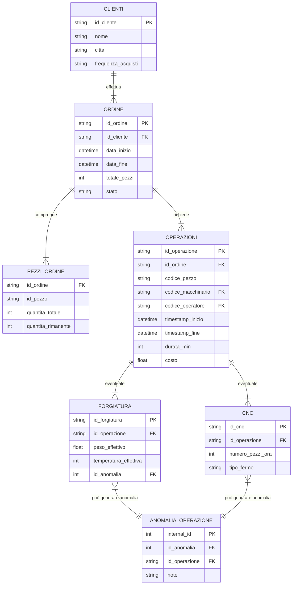

<h1>Pipeline di Generazione Dati per il Settore Manifatturiero e Rilevamento Anomalie</h1>

  

---

## **Indice dei Contenuti**  
1. 📋 [Introduzione](#introduzione)  
2. 🎯 [Funzionalità Principali](#funzionalità-principali)  
3. 🛠️ [Stack Tecnologico](#stack-tecnologico)  
4. 📁 [Modello dei Dati](#modello-dei-dati)  

---

## 
**Introduzione**
  

Questo repository contiene una **pipeline di generazione dati** ideata per simulare i processi di un'azienda manifatturiera. Lo scopo è **produrre dataset realistici** per:  

🔹 **Clienti**, con profili di acquisto differenziati.  
🔹 **Macchinari**, con dati relativi a costi di acquisto e manutenzione.  
🔹 **Operatori**, con costi orari ed esperienze diversificate.  
🔹 **Tipi di Acciaio / Leghe** e **Pezzi** con specifiche tecniche.  
🔹 **Magazzino** per monitorare la disponibilità di materiale e i cicli di restoccaggio.  
🔹 **Ordini** e relative **righe d’ordine**, con stagionalità e tassi di crescita.  
🔹 **Operazioni** di produzione, incluse lavorazioni specifiche di **Forgiatura** e **CNC**.  
🔹 **Anomalie** collegate a macchinari e operazioni, per simulare malfunzionamenti reali.  

🎯 L’obiettivo è fornire dati ad **alto volume e varietà**, da utilizzare per analisi, test di algoritmi di machine learning o per simulare scenari industriali complessi.  

---

## 
**Funzionalità Principali**
  

1. **Tasso di Crescita & Stagionalità**  
   📈 Imposta un fattore di crescita annuale (`GROWTH_RATE`) per il numero di ordini.  
   📅 Applica **fattori di stagionalità** per simulare variazioni di domanda mensili (es. cali ad agosto).  

2. **Pattern Nascosti di Anomalia**  
   🔥 Verifica soglie di **temperatura**, **età della macchina** e **numero di operazioni consecutive**.  
   ⚠️ Aumenta la probabilità di anomalia in condizioni particolari (es. macchine vetuste).  

3. **Generazione di Ordini in Parallelo**  
   ⚙️ Utilizza `ThreadPoolExecutor` per velocizzare la creazione degli ordini tra **2019** e **2025**.  
   🚀 Riduce sensibilmente il tempo di generazione per volumi di dati elevati.  

4. **Operazioni Avanzate (Enhanced)**  
   🕒 Calcolo di **timestamp inizio/fine**, **durata** e **costo** per ogni operazione.  
   🛠️ Adjust dinamico della durata in base all’**età** e all’**uso** del macchinario.  

5. **Output Multiplo in Formato CSV**  
   📁 Produce diversi file CSV (`cliente.csv`, `ordine.csv`, `operazioni.csv`, ecc.), ognuno corrispondente a un’entità o relazione specifica.  

---

## 
**Stack Tecnologico**
  

| **🔧 Tecnologia**         | **📋 Descrizione**                                                |
|--------------------------|------------------------------------------------------------------|
| **Python 3.8+**          | Linguaggio di programmazione principale.                        |
| **pandas**               | Utilizzato per gestire i DataFrame e l’export in CSV.           |
| **numpy**                | Fornisce generatori casuali e funzioni di calcolo su array.     |
| **faker**                | Genera nomi, indirizzi e testi fittizi e verosimili.            |
| **concurrent.futures**   | Abilita l’elaborazione in parallelo (multithreading).           |
| **cProfile** & **pstats**| Strumenti per profilare e analizzare le prestazioni del codice. |

---

## 
**Modello dei Dati**
  

La seguente rappresentazione **semplificata** mostra le principali relazioni tra le tabelle generate dalla pipeline:

### Diagramma delle Relazioni  

