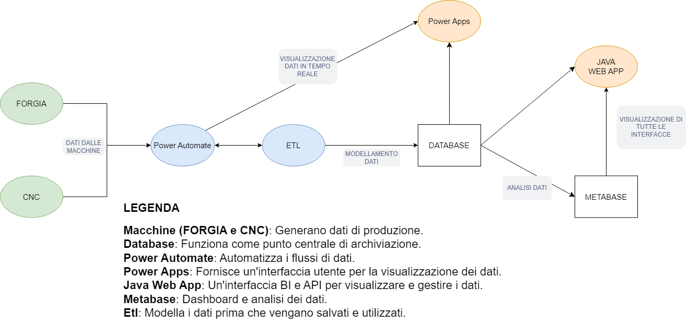

# **Lab Integrato**
Repo del corso **Laboratorio Integrato (ERP-Fintech)**  
***

## Indice
1. [Introduzione](#introduzione)
2. [Struttura del Sistema](#legenda)
3. [Flusso Complessivo](#flusso-complessivo)
4. [Vantaggi del Sistema](#vantaggi-del-sistema)
5. [Connessioni ai Database](#connessioni-ai-database)
6. [ETL Python in Cloud](#etl-python-in-cloud)

## Introduzione
Il sistema rappresentato integra più tecnologie per raccogliere, trasformare, analizzare e visualizzare i dati provenienti da macchinari industriali (**FORGIA** e **CNC**) in un ambiente centralizzato.  
L'obiettivo principale è:
- **Monitorare** i dati in tempo reale.
- **Analizzare** le prestazioni e identificare anomalie o inefficienze.
- **Generare previsioni** basate su dati storici, migliorando i processi decisionali aziendali.

  

### **Legenda**
- **Macchine (FORGIA e CNC):** Generano dati di produzione (es. temperature, anomalie, pezzi prodotti).
- **Database:** Funziona come punto centrale di archiviazione dei dati.
- **Power Automate:** Automatizza i flussi di dati e li trasferisce al sistema ETL.
- **ETL:** Modella i dati prima di salvarli nei database.
- **Power Apps:** Fornisce un'interfaccia per visualizzare i dati in tempo reale.
- **Metabase:** Strumento BI per l'analisi e la visualizzazione dei dati.
- **Python ML:** Addestra modelli di machine learning per previsioni.
- **Java Web App:** Gestisce l'interazione con i dati e fornisce un'interfaccia per gli utenti.

---

## Descrizione del Flusso

1. **Macchine (FORGIA e CNC)**:
   - **Ruolo**: Generano dati di produzione relativi ai processi industriali, come temperature, numero di pezzi prodotti, errori e anomalie.
   - **Dati generati**: Informazioni grezze che devono essere trasformate e archiviate.

2. **Power Automate**:
   - **Ruolo**: Automatizza la raccolta dei dati dalle macchine e li trasferisce al modulo ETL.
   - **Funzionalità**: Garantisce che i dati vengano raccolti in modo continuo e affidabile.

3. **ETL (Extract, Transform, Load)**:
   - **Ruolo**: Modella i dati grezzi ricevuti da Power Automate, esegue trasformazioni per migliorare la qualità e li carica nei database di staging Postgre.
   - **Modello dei dati**:
     - **Database MySQL**: Usato per archiviare i dati relazionali, come registrazioni strutturate di operazioni e pezzi.
     - **Database PostgreSQL**: Usato come database di staging per non appesantire il datadase di produzione (MySQL).

4. **Power Apps**:
   - **Ruolo**: Fornisce un'interfaccia utente per la visualizzazione in tempo reale dei dati raccolti e processati.
   - **Esempi di utilizzo**: Monitoraggio delle prestazioni delle macchine e degli allarmi in tempo reale.

5. **Metabase**:
   - **Ruolo**: Dashboard interattiva e BI per analizzare i dati storici salvati nei database.
   - **Funzionalità**: Permette di creare report dettagliati e grafici utili per prendere decisioni strategiche.

6. **Python ML**:
   - **Ruolo**: Elabora i dati storici per addestrare modelli di Machine Learning in grado di effettuare previsioni sulle operazioni future.
   - **Esempi di previsioni**: Stima di tempi di lavorazione, identificazione di anomalie o manutenzioni predittive.

7. **Java Web App**:
   - **Ruolo**: Funziona come hub centrale per la gestione e la visualizzazione dei dati raccolti e per l'interazione con tutte le componenti del sistema.
   - **Funzionalità**:
     - Fornisce API per la gestione dei dati.
     - Mostra una panoramica completa delle operazioni, delle previsioni e delle analisi.

---

## Flusso Complessivo

1. I dati generati dalle macchine (**FORGIA** e **CNC**) vengono raccolti automaticamente da **Power Automate**.
2. Il modulo **ETL** processa e carica i dati nei database.
3. Gli utenti possono accedere ai dati tramite:
   - **Power Apps**, per il monitoraggio in tempo reale.
   - **Java Web App**, per una panoramica completa e gestione delle operazioni.
4. I dati storici vengono inviati al modulo **Python ML**, che addestra modelli per fornire previsioni utili per l'ottimizzazione del processo.

---

## Vantaggi del Sistema

- **Automazione**: Riduce l'intervento manuale nei flussi di dati.
- **Monitoraggio in tempo reale**: Identifica anomalie e inefficienze rapidamente.
- **Analisi approfondita**: Permette di comprendere trend e ottimizzare le decisioni aziendali.
- **Previsioni affidabili**: Modelli di Machine Learning aiutano a prevedere e prevenire problematiche operative.

***

## Connessioni ai Database

***

  

## **Stringa connessione database MySQL (Produzione)**

- **Database Name:** `defaultdb`  
- **Host:** `lab-integrato-nicola03-3bd5.f.aivencloud.com`  
- **Port:** `16921`  
- **User:** `avnadmin`  
- **Password:** `AVNS_frpyP32fGueJJfnhssZ`  
---

  

## **Stringa connessione database PostgreSQL (Staging)**

- **Database Name:** `defaultdb`  
- **Host:** `stagingdb-nicola03-3bd5.b.aivencloud.com`  
- **Port:** `16921`  
- **User:** `avnadmin`  
- **Password:** `AVNS_d8E015YWPMvo61VuSsY`  

---

  

## **ETL Python in Cloud**

L'applicazione è accessibile al seguente indirizzo:  
**[ETL Project](https://etlprj.osc-fr1.scalingo.io/)**  

### **API**

1. **Run Script:**  
   (https://etlprj.osc-fr1.scalingo.io/run)  
   Fa partire lo script Python per modellare tutti i dati dal database PostgreSQL e li salva su MySQL.  

2. **Status:**  
   (https://etlprj.osc-fr1.scalingo.io/status)  
   Restituisce i dati processati con successo.  

3. **Logs:**  
   (https://etlprj.osc-fr1.scalingo.io/logs)  
   Mostra i log del progetto per monitorare le attività e diagnosticare eventuali problemi.  

   (https://etlprj.osc-fr1.scalingo.io/log-cron)  
   Mostra i log del progetto per monitorare le attività eseguite periodicamente.  

   (https://etlprj.osc-fr1.scalingo.io/clear-logs)  
   Pulisce i file di log.  

4. **Dati:**  
   (https://etlprj.osc-fr1.scalingo.io/data)  
   Mostra le tabelle Forgiatura e dati_anomali del database MySQL e i dati registrati.
